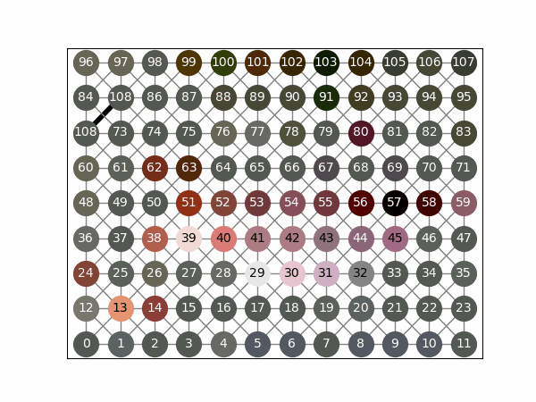

Theory and intuition
====================

ShapBPT explains image predictions by organizing pixels into a hierarchical
coalition structure and then recursively estimating Owen-value style
contributions.

Why a Binary Partition Tree?
----------------------------

A Binary Partition Tree (BPT) is built bottom-up:

* start from individual pixels or primitive regions,
* iteratively merge adjacent regions,
* continue until a single root region remains.

This hierarchy provides ShapBPT with a data-aware coalition structure used to compute Shapley feature attributions. Where SHAP’s Partition Explainer uses Axis-Aligned splits, ShapBPT uses morphological clusters guided by the actual image content.

Because regions can be recursively split down to individual pixels, the method gracefully balances efficiency and fidelity.

How it is built and used?
-------------------------

A Binary Partition Tree is built bottom-up, starting from the individual pixels and then merging adjacent regions that minimize a distance function, until all regions are merged into a single cluster. The tree that forms is the BPT tree.

In practice, the BPT hierarchy is used top-down, starting from the root cluster and splitting adaptively. ShapBPT uses the BPT hierarchy to generate feature attributions in the form of (Owen approximations) of the Shapley coefficients.

.. list-table::
   :align: center

   * - .. image:: /_static/sequence_BPT.gif
         :width: 300px

     - .. image:: /_static/sequence_AA.gif
         :width: 300px

Why Owen values?
----------------

Once a hierarchical coalition structure is available, the attribution problem
can be solved over that structure rather than over all flat feature subsets.
This allows recursive refinement from coarse regions to finer regions.

BPT vs axis-aligned partitioning
--------------------------------

ShapBPT supports two hierarchy choices:

* ``method="BPT"`` for a data-aware binary partition tree,
* ``method="AA"`` for an axis-aligned baseline.

The BPT mode is intended for explanations that follow meaningful image regions,
while the axis-aligned mode provides a useful comparison point.