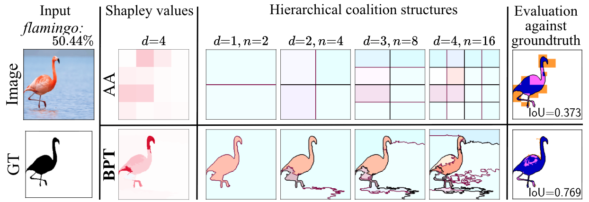

ShapBPT documentation
=====================

**ShapBPT** is a Python package for generating **data-aware image feature attributions**
using Owen values over **Binary Partition Trees (BPTs)**. 
**ShapBPT** is **model-agnostic** and operates through a **masking function** interface, making it applicable to a wide range of **black-box** models.
ShapBPT extends well known method `Shap <https://github.com/shap/shap>`_. If you use ShapBPT in your research and enjoying, please consider citing our `AAAI-26 paper <https://arxiv.org/abs/2602.07047>`_:

.. code-block:: bibtex

   @inproceedings{rashid2026shapbpt,
   title={{ShapBPT: Image Feature Attributions Using Data-Aware Binary Partition Trees}},
   author={Rashid, Muhammad and Amparore, Elvio G and Ferrari, Enrico and Verda, Damiano},
   booktitle={Proceedings of the AAAI Conference on Artificial Intelligence},
   volume={40},
   number={30},
   pages={25099--25107},
   year={2026},
   url={https://doi.org/10.1609/aaai.v40i30.39699}
   }

**HOW IT WORKS and Comparison with Shap-AxisAligned**

🚀 Key Features
---------------

* Data-aware hierarchical explanation using Binary Partition Trees (BPT)
* Owen-value based recursive attribution
* Model-agnostic design via masking functions
* Axis-aligned baseline (AA) for comparison
* Supports real-world pipelines (ImageNet, detection, anomaly detection)

⚡ Quick example
----------------

.. code-block:: python

   import shap_bpt

   explainer = shap_bpt.Explainer(fm, image, num_explained_classes=4)

   shap_values = explainer.explain_instance(
       max_evals=1000,
       method="BPT"
   )

   shap_bpt.plot_owen_values(explainer, shap_values, class_names)

📦 Installation
---------------

.. code-block:: bash

   pip install shap-bpt
   

Why ShapBPT? Key Advantages
---------------------------

ShapBPT extends hierarchical Shapley-value explanations by introducing a
data-aware partitioning of the input space tailored for images.

**Key advantages:**

* **Model-agnostic**
  
  ShapBPT only requires a masking function and does not depend on access to
  model internals, making it applicable to arbitrary black-box models.

* **Data-aware explanation structure**
  
  Instead of relying on axis-aligned grids, ShapBPT builds a Binary Partition
  Tree (BPT) from the image itself, producing explanations that better align
  with meaningful visual regions and object boundaries.

* **Efficient Owen-value approximation**
  
  The hierarchical structure enables a recursive Owen-value formulation,
  significantly reducing the number of model evaluations compared to flat
  Shapley computation.

* **Interpretable multi-scale explanations**
  
  Explanations are naturally organized across multiple scales, allowing users
  to inspect both coarse and fine-grained contributions.

* **Drop-in baseline comparison**
  
  By setting ``method="AA"``, ShapBPT reproduces axis-aligned hierarchical
  partitioning, enabling direct comparison with grid-based SHAP methods within
  the same interface.

📚 Documentation Overview
-------------------------

.. toctree::
   :maxdepth: 2
   :caption: Getting started

   installation
   quickstart
   masking_function

.. toctree::
   :maxdepth: 2
   :caption: User guide

   explainer/index

.. toctree::
   :maxdepth: 2
   :caption: Examples

   notebooks/index

.. toctree::
   :maxdepth: 2
   :caption: Additional pages

   plotting

.. toctree::
   :maxdepth: 2
   :caption: API reference

   api

.. toctree::
   :maxdepth: 1
   :caption: Development

   repo_map